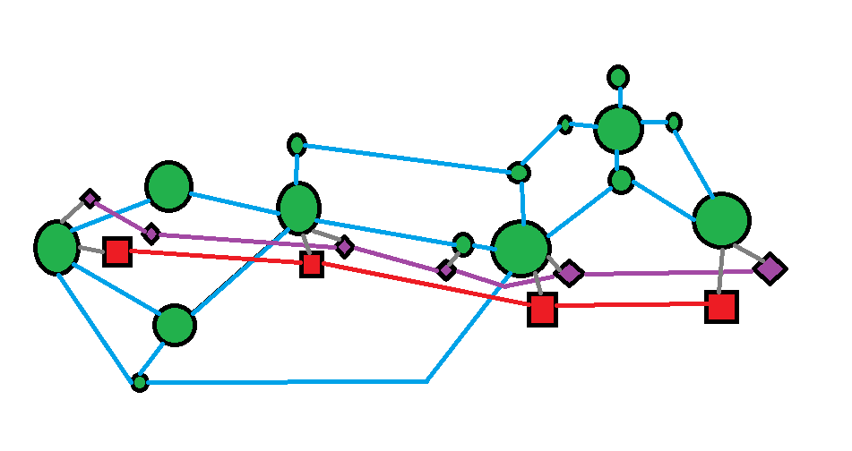
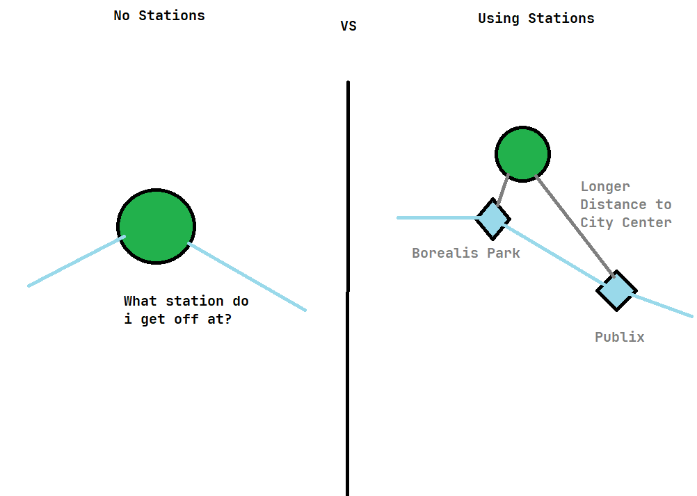
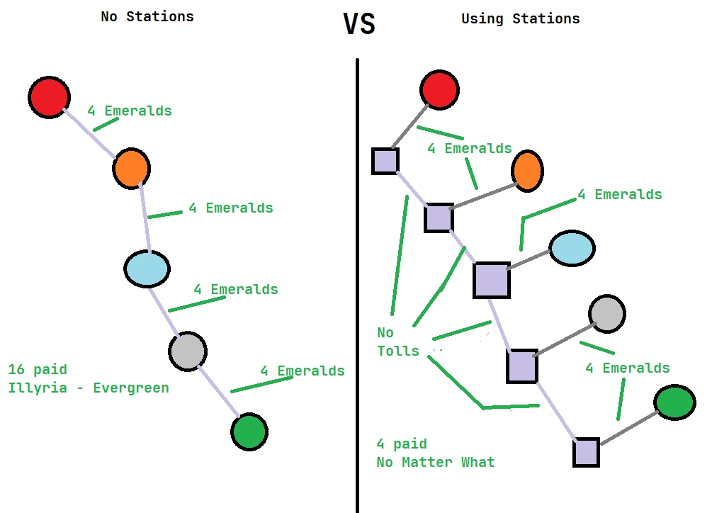

# Technical Info

- [Technical Info](#technical-info)
  - [Quick Overview](#quick-overview)
  - [The Node Graph](#the-node-graph)
    - [Tri-Layered Graphing](#tri-layered-graphing)
      - [Specificity](#specificity)
      - [Toll Counting](#toll-counting)
  - [Compiling the graph](#compiling-the-graph)
  - ["A\* in the night sky"](#a-in-the-night-sky)

## Quick Overview

There is a single function that controls all the routing processes, from data manipulation to tracking how long it takes.
This is activated by the user clicking the "Route!" button.

The function then takes all the settings from the user, along with the location graph, and creates a node graph that is parsable by A-Star. This is the longest part of the base process due to the sheer amount of data it needs to handle.\
It does this by calculating the weight of the node's routes, and if its lower it adds or overrides it on the output graph. A specific route can be overwritten many, many times within the same loop, with the weight going lower and lower each time. During this stage, weights can also be altered manually in either direction, up or down, depending on the factors the user chooses. This is primarily used to avoid tolls and for the alternative routing methods.\
Also during this process, a second graph is made and being written to simultaneously. It contains the data for the renderer to use to determine what the route it, it's method, and how it should be handled with rendering.

The AStar function is the part where the actual routing happens, based on the [A* pathing algorithm](https://en.wikipedia.org/wiki/A*_search_algorithm). It sends back a list of nodes and methods it followed to get this route, or an error message if one occurs. This is the simplest part of the process.

From here, all the data from the pathing and compiling functions get passed into the rendering functions. This is a text based explanation similar to Seacrestica Transport's website's full route description, but will a bunch of extra data attached, like who owns the roads/rails/iceways, the distance between nodes, all the other nodes along it, the estimated time, etc. This section is based off [Seacrestica Transports's](https://niklas20114552.github.io/st-transports/) router, with heavy modification and only sharing code with the `secondStringify()` function.

## The Node Graph

Here is an example of a node:

```javascript
const routes = {
    // ...
    "Outpost": [
        [-1890764,-1894658],
        {
            roadways: {
                "UV-OP-201 UV-OP-2 Intersection": [["UV-OP-2"], 1200],

                "Evergreen": [["UV-OP-1", "UV-VY"], 1200],
                "Stonehelm": [["UV-OP-1", "UV-OP-2", "UV-VY"], 1200],
            },
            iceways: {
                "Illyria": [["OPE Ouest"], 1200],
                "Stonehelm": [["EGRK Expressway"], 1200],
            },
            walkways: {
                "Outpost UltraStar Station": [
                    ["Outpost UltraStar Station Main Entrance"], 
                    245, 
                    {
                        currency: "Emerald",
                        price: 4,
                        pass: "SeaCard",
                        passPrice: 2
                    }
                ]
            },
        },
        {
            layer: "overworld"
        }
    ]
    // ...
}
```

Lets go from top to bottom:

- First is the node name. If its a town or destination it should be the same as the one in the `places` variable, and the name has to be unique.
- Next is the coordinates, the Y coordinate is dropped due to it not being useful to us.
- Then the routes;
  - Each route is formatted in this manner:
    - Destination Node Name
    - Transit Name(s)
      - Usually the name of the train line or highway in question
    - Distance in Blocks/Meters
    - Toll (if applicable)
      - The toll is again split up into 4 sections:
        - `currency` is the type of currency the toll requires. Common currencies are Diamond, Emerald, and Paper.
        - `price` is the amount of that currency needed to pass the toll.
        - `pass` is the name of the pass that allows you to skip the toll. Currently only SeaCard and EasyPass are options.
        - `passPrice` is the price that is paid if the user checked the box saying they have a specific pass.
  - The `roadways` section is for connected roadways, be it UVDOT highways or other nearby roads that aren't numbered.
    - The space between "UV-OP-201 UV-OP-2 Intersection" and "Evergreen" is to tell people who are adding onto the network graph that the "UV-OP-201 UV-OP-2 Intersection" node can not be selected from the UI, but still exists. Same thing with the "Outpost UltraStar Station" node, but this time there are no other connections so the space doesnt make sense to add.
  - The `railways`, `walkways` and `iceways` sections are for minecart railways, roads too small for a horse/short distances, and ice boat tunnels respectively.
- Lastly, some extra metadata;
  - `layer` is the layer that the node is on, either `overworld`, `nether`, or `station`
    - This has no use on the website, it's only used with the work-in-progress node management tool

Now, you might be wondering what that last part was for, specifically the `layer` part.

### Tri-Layered Graphing

The graph is broken up into three layers:

- Overworld
  - The main layer, almost everything selectable in the UI is on the layer
- Underground
  - Used by Trains, Iceways, their stations etc.
- Nether
  - Used by nether portals and Iceways

Pictured here is a visual example of New Spawn's tri-layer node graph. Red is Nether, Purple is Underground (specifically the Spawn Purple Iceway Line), and Green/Blue is Overworld.\
Note that this is simultaneously truncated for simplicity, significantly out of date, and completely unlabeled.



There are 2 main reasons for this split:

#### Specificity

Take Borealis as an example.

There are two iceway stations on the Purple line underneath the city.\
How do you know which one to get off at?

Without the Overworld-Underground split I would have to specify where the station is, and when to get off after the fact.\
While this is possible, its just more convenient to have every station separated for specificity.



#### Toll Counting

Originally the entire UltraStar system's pricing was broken due to the simple fact the toll value was set on the rails instead of the stations.

With the separation of the Overworld and the Stations, this was easily fixed.



## Compiling the graph

TODO

## "A* in the night sky"

This is honestly the easiest part of the process to explain.

Think of a ball rolling down a hill. This ball is following a hill made out of increasingly lowering dots, the height of these dots is the distance away from the goal dot. It makes a list of the dots that it rolls over until the ball hits 0, or the bottom of this hill. At this point it gives the list of dots that it hit back, giving back the fastest possible route to a specified destination.\
Thats the most basic explanation I've found for A*, and I forget where I heard it from, but it help me understand how it works way better.

If you want to read more info the A* pathing algorithm, read up on it on the [Wikipedia page](https://en.wikipedia.org/wiki/A*_search_algorithm).
